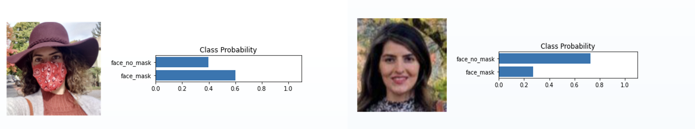

# Face Mask Detection

This project focuses on detecting whether individuals are wearing face masks using both classical machine learning (MLP) and deep learning (CNN with transfer learning). It demonstrates the development and comparison of different modeling strategies for a real-world classification task.

---

## 🎯 Objective

To develop models that can classify face images as:
- Wearing a mask (`face_mask`)
- Not wearing a mask (`face_no_mask`)

---

## 🧠 CNN Model with Transfer Learning (PyTorch)

The `Mask_Pytorch_Transfer_learning.ipynb` notebook implements a deep learning pipeline for face mask detection using **PyTorch** and **transfer learning**. A pre-trained CNN model (e.g., DenseNet121) is fine-tuned on a labeled dataset of masked and unmasked face images.

Key components:
- Uses transfer learning to leverage pre-trained image features
- Preprocesses images by resizing and converting to tensors
- Trains and evaluates on a custom image dataset from Google Drive
- Achieves high accuracy (~97%) 

This model significantly outperforms classical baselines and demonstrates the strength of deep learning for image classification.

---

## 📦 Classical MLP Model (Baseline)

The `Mask__MLP.ipynb` notebook implements a basic image classification pipeline using a **Multi-Layer Perceptron (MLP)** model. Face images are resized, flattened into feature vectors, and used to train a classifier that predicts whether the person is wearing a mask. While less powerful than CNN-based approaches, this notebook demonstrates a classical machine learning baseline for comparison.

---

## 📊 Model Performance Summary

### Confusion Matrix & Classification Report

The following figure displays the confusion matrix (left) and the full classification report (right) from the DenseNet121-based model:


---

### 🔍 Real-World Prediction Example

To assess how well the model generalizes, predictions were made on images not included in the training or validation datasets. The example below shows the correct predictions on two photos of the author:

<p align="center">
  
</p>

---

## 📁 Files

- `Mask_Pytorch_Transfer_learning.ipynb`: Transfer learning using PyTorch
- `Mask__MLP.ipynb`: Classical ML (MLP baseline)
- `Model_Performance.png`: Confusion matrix + metrics
- `Demo_Output.png`: Model prediction results on non-training author photos
- `Face_mask_recognition.pdf`: Full project report

---

## 🔧 Tools & Technologies

- Python, PyTorch, scikit-learn
- NumPy, OpenCV, Matplotlib
- Jupyter Notebook

---

## 🚀 How to Run

```bash
git clone https://github.com/HabiAshourichoshali/Face_Mask_Detection.git
cd Face_Mask_Detection
pip install -r requirements.txt  
jupyter notebook
---

## 📂 Datasets

This project uses publicly available datasets from Kaggle for training and evaluation:

- [Mask Detection Dataset by Alexandra Lorenzo](https://www.kaggle.com/alexandralorenzo/maskdetection)  
- [Face Mask Detection Dataset by Wobot Intelligence](https://www.kaggle.com/wobotintelligence/face-mask-detection-dataset)  
- [Face Mask Detection by Andrew Mvd](https://www.kaggle.com/andrewmvd/face-mask-detection)  
- [YOLOv3 Starter Kit by Alexandra Lorenzo](https://www.kaggle.com/alexandralorenzo/yolov3-startkit)  

These datasets include labeled images of individuals with and without masks, and were used to train and test both deep learning and classical models.

---
